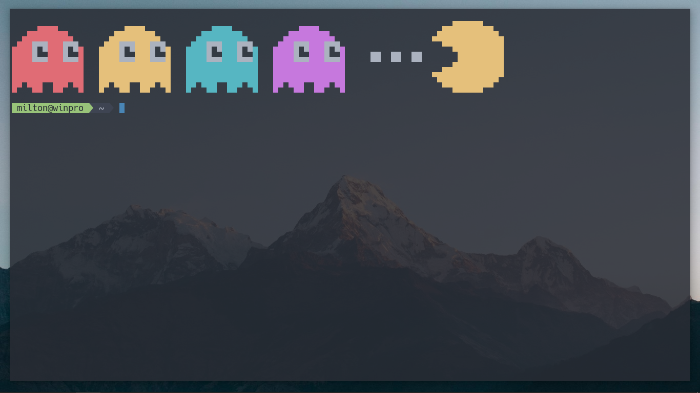

# Description
Terminal color scripts for the windows command-line.



# Setup
Open PowerShell and execute,
```powershell
notepad $PROFILE
```
A pop-up might appear, proceed with `Yes` and add these two lines at the top of the script,
```powershell
Clear-Host
C:\User\John Doe\ps-art\pacman.ps1 # An example path
```
**NOTE**: *Mention the absolute path to the* `.ps1` *script file*.

To see the results perform,
```powershell
. $PROFILE
```

Next time and every time you open your terminal you can see my pixel art work!
